# bottleneck

**You are the bottleneck. Let nothing get past you.**

Run more than two or three Claude Code sessions and the limit stops being the
model and becomes your attention. The work is done and waiting; you are the part
whose judgement it is waiting on. Heads sit finished or blocked in terminal
windows you are not in, and the time they lose is time you spent deciding which
window to check.

So this does one thing: it keeps a queue of heads that want you, sorted by who
has waited longest, and gives you a single key that always takes you to the next
one. Answer, press it, land in the next. When nothing is waiting it says so and
gets out of the way, rather than making you go and find out.

It does not manage the agents. It manages the queue in front of you.



`›` needs you · `●` is the head in the main pane · the number stays with a head
as the rows reorder.

Up and down walk the whole list, groups and all. Left and right jump a group at
a time. Nothing is modal — no key changes what the other keys mean, so you never
have to remember which way the arrows are pointing today. The one exception says
so on the screen while it holds them: `G` `p`, where the arrows move a group
through the list until you press Enter.

**The whole row is lit for the head open beside you** — a fact about your panes,
so you can find it without reading. **`▸` and a lit name mark the row your arrow
keys are on** — a choice, and only that. Group it, hold it or kill it without
opening it; press Enter when you do want it. The two used to be one highlight,
which meant the only way to act on a head was to open it first.

Each head gets a row, and under it what the head is doing or wants from you,
wrapped to the pane. On one line that summary was the first thing a narrow pane
cut off, and it is the part you are reading the list for. Long ones stop after
two lines and say so; `BOTTLENECK_SUBLINES` moves the limit.

Above the summary, marked `·`, is the last prompt you typed at that head. The
summary is read off the head's own last message, so on its own it can tell you
that something was committed and pushed without ever saying what the head is
for — and a row that says `» I checked my leading hypothesis and it's wrong`
is unreadable until you know what was being checked. Slash-command expansions,
subagent briefs and notifications are not prompts and do not appear.
`BOTTLENECK_TASKLINE=attention` keeps the line only on rows asking for you,
`off` removes it.

A head that ends its turn on a question gets that question as its summary,
prefixed `asks:` — the same prefix a question asked through the tool gets. The
closing line is the part you can answer; the opening line is a report of work
already done, which the state column has told you about.

## Not an orchestrator

It does not run agents for you, hand out tasks, make git worktrees, open pull
requests, or hold opinions about how you should work. Several tools in this
space do those things and do them well. This one solves the smaller problem
underneath them: **Claude Code is open in six windows and you cannot see which
one needs you.**

That keeps the design to windows rather than workflow, and it composes instead
of competing. Want worktree isolation? Start a head in a worktree directory like
any other — bottleneck will not know or care. Nothing here asks you to adopt a
way of working; it just puts the waiting work in front of you.

## The layout

```
┌──────────────────┬────────────────────────────────┐
│ bottleneck       │ the head you are talking to    │
│  › 1 BLOCKED …   │                                │
│  ● 2 working …   │  (62% of the width)            │
│    3 DONE …      │                                │
└──────────────────┴────────────────────────────────┘
```

One window, two panes. The dashboard sits on the left; the head you are working
with sits on the right. Every other head waits in its own hidden window.
Choosing a head **moves its pane** into the main window (`tmux join-pane`) and
sends the previous one back out (`break-pane`) — a running process cannot be
displayed in a different pane, so it gets relocated instead.



The permission prompt on the right is why the row on the left says `BLOCKED`,
and the head that goes `DONE` while you are typing is one you never had to go
looking for. The left half of that picture is `render()` again; the right half
is hand-drawn, because Claude Code's screen is not ours to generate.

## Requirements

Linux (it reads `/proc`), tmux, Python 3.8+, and Claude Code.

## Install

```sh
git clone https://github.com/keats4543-sys/bottleneck ~/bottleneck
bash ~/bottleneck/install.sh
bottleneck start
```

The installer symlinks `bottleneck`, `bottleneck-new` and `bn` into
`~/.local/bin`, and touches five things outside the checkout:

| Path | Change |
|---|---|
| `~/.local/bin/*` | three symlinks |
| `~/.claude/hooks/bottleneck-attention.py` | symlink to `hooks/attention.py` |
| `~/.claude/hooks/bottleneck-<module>.py` | one per [module](#modules) that wants a hook |
| `~/.tmux.conf` | one marker-guarded `source-file` line |
| `~/.claude/settings.json` | the core's 4 hooks, plus whatever the modules ask for |

Both edits are marker-guarded and reversible: `install.sh --unmount` puts them
back and leaves your checkout and state alone. `--purge` also deletes
`~/.bottleneck`.

Because it installs symlinks, editing the checkout takes effect immediately.

## Keys

Single keys in the dashboard pane, no prefix:

| Key | Action |
|---|---|
| `↑` `↓` | point at a row, within the group you are in |
| `PgUp` `PgDn` | hop to the next group, still picking a head |
| `←` `→` | step out to group level, and back in |
| `Enter` | open the row you have pointed at |
| `1`-`9` | move that head into the main pane (see [numbers](#the-numbers)) |
| `j` | go on — next head that wants you, else park and cycle (see below) |
| `a` | auto-raise on/off |
| `n` | new head (offers a name, then asks the directory) |
| `r` | resume — lists prior sessions by name, pick a number |
| `g` | put the cursor in the head's pane |
| `x` | kill a head — asks which, defaults to the one in the main pane |
| `G` | put this head in a group — then a digit, `0` to clear |
| `N` | name that group — a label instead of a number, `-` to clear |
| `[` `]` | move its group up / down the priority order |
| `G` `p` `r` `d` | prioritize, name or disband any group — not only the one you are in |
| `h` | hold this head — done, but below the heads still working |
| `c` | clear all attention flags |
| `R` | reload — hand the pane to the current code (see below) |
| `q` `q` | quit the dashboard — twice, within five seconds |

Quitting asks first. Closing the dashboard stops no heads — they are separate
processes in their own windows and never notice — but it does take away the one
view of them, the queue's key bindings and the counter in the status line, and
one key next to nothing else you press is too little to hang that on. The first
`q` puts a bar across the pane saying you are trying to quit; a second within
five seconds leaves, and any other key stays. `Ctrl-C` and `Ctrl-D` still go
straight out — they are not keys you land on by accident.

While typing at a head, no prefix needed:

| Key | Action |
|---|---|
| `Alt+Enter` | press Enter at this head, then go on — one key for "sent, next" |
| `Alt+j` | go on without submitting anything |
| `Alt+a` | same as `Alt+j` |
| `Alt+d` | back to the dashboard |
| `Alt+o` | between the list and the head — one key, both ways |
| `Alt+←` / `Alt+→` | between the two panes |

With prefix: `F` rebuild the layout, `a` jump, `Enter` send-and-go (for
terminals that swallow `Alt+Enter`), `R` reload after editing the checkout.

### Changing them

Every key above is a default, not a fixture. They come from
`~/.bottleneck/config` like everything else:

```
BOTTLENECK_KEY_SENDGO=prefix:Enter,M-'
```

Comma-separated, in the order you want them bound. A bare key is no-prefix, so
it works while you are typing at a head; `prefix:` in front means after your
tmux prefix. The names are tmux's own, so anything tmux accepts works - `M-j`,
`C-Space`, `F5`, `prefix:Enter`. An empty value binds nothing at all, which is
how you hand a key back to whatever else wanted it:

```
BOTTLENECK_KEY_SENDGO=
```

| Action | Default | What it does |
|---|---|---|
| `BOTTLENECK_KEY_NEXT` | `M-j,M-a,prefix:a` | go on to the next head |
| `BOTTLENECK_KEY_SENDGO` | `M-Enter,prefix:M-Enter,prefix:Enter` | press Enter here, then go on |
| `BOTTLENECK_KEY_DASH` | `M-d` | back to the dashboard |
| `BOTTLENECK_KEY_SWAP` | `M-o,prefix:o` | between the list and the head |
| `BOTTLENECK_KEY_LEFT` / `_RIGHT` | `M-Left` / `M-Right` | between the two panes |
| `BOTTLENECK_KEY_START` | `prefix:F` | build the layout |
| `BOTTLENECK_KEY_RELOAD` | `prefix:R` | reload after editing the checkout |

`bottleneck keys` prints what you have set. `bottleneck reload` applies it -
the bindings are written to `~/.bottleneck/keys.conf` and sourced by tmux,
which is also done on every `start` and every dashboard launch.

The keys inside the dashboard itself - `j`, `n`, `x` and the rest - are not
configurable: they are read by the program, not by tmux, and are only ever
pressed with the list in front of you.

### On Windows, through WSL

`Alt+Enter` never arrives. Windows Terminal binds it to **toggle full screen**
before anything reaches WSL, so the key that means "sent, next" opens a
full-screen window instead. The legacy console host does the same thing and
cannot be told otherwise.

Two ways round it, and the first needs nothing from Windows. Move the key:

```
BOTTLENECK_KEY_SENDGO=prefix:Enter,M-'
```

in `~/.bottleneck/config`, then `bottleneck reload`. That also hands `Alt+Enter`
back to Claude Code, which reads it as "newline, do not submit".

Or take the key back on the Windows side and keep the default. In Windows
Terminal: `Ctrl+,` → **Actions** → find *Toggle full screen* and delete the
`Alt+Enter` row. Or in `settings.json`, in the `actions` array (`keybindings`
in older versions):

```json
{ "command": "unbound", "keys": "alt+enter" }
```

`F11` still toggles full screen, so nothing is lost. On the legacy console host
there is nothing to unbind at all - move the key instead.

Either way the prefix keys work untouched: `prefix Enter` for send-and-go,
`prefix a` to jump, `prefix o` to swap. And `Alt+j` and the rest are
unaffected - Windows Terminal claims none of those.

## Groups, and holding a head back

Two ways to say "this one matters more", both a keystroke.

**Groups.** `G` then a digit puts the head you are in into group 1–9; `0` takes
it out. `[` and `]` move that head's whole group up and down the priority
order. The
list sorts by group before it sorts by need, so the go-on key clears the first
group before it offers you anything from the second — however long the second
has been waiting. Groups are keyed by digit and ranked by a separate list, so
reprioritizing never renumbers the keys you have learned.

| | |
|---|---|
| `G` `2` | put this head in group 2 |
| `G` `0` | take it out |
| `N` | name the group this head is in |
| `G` `r` `⏎` | name the group you are standing in — a digit names another |
| `G` `d` `⏎` | disband it — its heads come back unassigned |
| `[` `]` | move the group you are in up / down the priority order |
| `G` `p` | the arrows move a group through the list — `⏎` sets it, `esc` puts it back |
| `bottleneck group <head> <n>` | the same from a shell |
| `bottleneck group name 2 "release work"` | give a group a label |
| `bottleneck group up 2` | move it in the priority order (`down` too) |
| `bottleneck group disband 2` | the same from a shell |
| `bottleneck groups` | who is in what, in order |
| `bottleneck new x -g 2` | start a head already in group 2 |

**Naming a group.** `N` calls the group the selected head is in something, and
`G` `r` asks which group — offering that same one on Enter, so a digit is only
needed for a group you are not in or one with nobody in it at all. Either way the label stands in for the number in
the group heading, in the `G` menu and in `bottleneck groups`, so a queue reads
`release work` and `reviews` rather than
`group 1` and `group 2`. Enter alone keeps the name it had, `-` hands the number
back. Nothing has to be named: an unnamed group reads as `group 2` and works
exactly the same, which is why `G` mentions the key only when the group you just
joined has no name yet. A name is also enough to make a group real on its own —
`bottleneck group name 3 "next week"`, or `G` `r` `3`, puts group 3 in the
priority order before anyone is in it, so you can lay the buckets out and fill
them later.

**Emptying and disbanding.** A group keeps its heading when the last head in it
exits, and says `empty`. It is a bucket you made and placed, not a side effect of
who happens to be running, and a group that vanished with its last head would
leave you unable to tell a group you had lost from a head you had lost — and
would come back later in an order you never chose. `G` `d` takes one apart for
good: the heads in it come back unassigned, the label and the place go, and so do
the assignments for sessions that ended long ago and any claim still waiting on
it. That last part is why it is a command and not three edits — a group lives in
its assignments as much as in the priority order, so one stale entry left is
enough to bring it back on the next listing. `d` offers the group you are standing in on Enter, like `r`, and works with
nothing selected at all — which is the state you are usually in when you want
it. It asks even when it has a default: disbanding should cost one keystroke
more than moving one does.

**Priority order.** `[` and `]` move the group you are standing in one place up
or down. `G` `p` hands the arrows to the priority order instead: the marked
group and its heads move through the list itself, a press at a time, and each
press is answered by the redrawn list rather than a line of text. A digit picks a
different group to move, `⏎` sets it, `esc` puts the order back the way it was.
It is the one place here that holds the keys for more than a keystroke, and it
earns that — a priority order is not something you know before you look, it is
something you find by watching the order change. It starts on the group you are
in, and reaches the ones you are not in and the empty ones. Heads keep their
numbers through all of it: the priority order decides which heads the go-on key
reaches first, not what anything is called.

**Grouping a head as you start it.** `bottleneck new -g 2` puts the new head in
group 2, and `n` in the dashboard asks which group after it asks the name —
Enter for none. A head has no session id until claude picks one a second later,
so the group is *claimed* against the name it launches under and handed over on
the first refresh that sees it. Set `BOTTLENECK_GROUP=2` in
`~/.bottleneck/config` and every head you start that way lands in group 2
without the flag. Claims are spent by the first head to wear the name and expire
after fifteen minutes, so one for a head that never starts cannot catch an
unrelated head later. `bottleneck claim <name> <n>` does the same by hand, and
takes a session id too.

**Unassigned heads sort last.** A group is a promise that this work comes first,
so anything you have not placed waits behind everything you have. Group nothing
and the list behaves exactly as it did.

**Holds.** `h` holds the head you are in: it stays in the list, keeps its
summary, and drops *below* the heads still working. This is for the head that is
genuinely done but that you are not ready to deal with — otherwise "finished"
outranks "busy" forever and it jumps the queue every time you look. The go-on
key skips it and auto-raise leaves it alone.

A hold is against one finished state, not against the head. The moment that head
does anything new — a fresh turn, another tool call — the hold has nothing left
to hold and lets go by itself. `h` again, or `bottleneck unhold <n>`, releases it
early.

## Modules

A module is a whole feature in one directory under `bottleneck/modules/`, and
the core knows only that modules exist. Each extension point below is one
generic line in the core that asks every module the same question.

That is worth the indirection for one reason: **a branch carrying a feature
edits no file that another branch also edits.** Two features are two
directories, and they merge as two directories rather than as six files touched
in the same six places.

| A module can | key | which the core asks |
|---|---|---|
| add a command | `commands` | after every command of its own, so it can add one and never take one |
| add to `--help` | `usage` | at the bottom of the help |
| ask for a state directory | `state` | at install |
| put a badge on a head's row | `mark` | while drawing that row |
| put lines under a head | `lines` | under everything the core says about it |
| put a line under a group heading | `group` | with that group's heads |
| add to the tmux status line | `status` | after the attention counter |
| be told the fleet was looked at | `pass` | every refresh, before anything is drawn |
| be told what changed | `notice` | heads appearing, going, changing state or group; groups renamed |
| bind a key | `keys`, `key_help` | after every key the core has, with the row you are pointing at |
| take a word on the control fifo | `ctl` | after the core's own verbs — the way in from outside |
| have a claude hook installed | `hook`, `events` | by `install.sh`, wired to the events the module names |

Text a module hands back is cut to size and stripped of escapes before it is
drawn: a feature adds to the list, and cannot take the columns the list is made
of or turn a status segment into a tmux directive.

```
bottleneck modules              what is plugged in, and what each adds
BOTTLENECK_MODULES=a,b          load only these
BOTTLENECK_MODULES=none         the core alone, for when something is odd
```

A module that will not import, or that throws at any of those points, is
disabled and named — never a dashboard that will not start, and never one that
dies on a timer or halfway through drawing a frame. Modules may import the core;
the core never imports a module, only the registry.

This branch carries one:

| Module | What it does |
|---|---|
| [`share`](bottleneck/modules/share/README.md) | heads in a group tell each other their goals and what files they have changed |

## The numbers

The queue sorts by who needs you most and how long they have waited, so rows
move on their own while you are reading them. If the number were the row, `2`
would mean a different head by the time you pressed it.

So it is not the row. A head is given a number when it first appears and keeps
it until it is gone; the row it sits on is free to move. Numbers freed by a dead
head get handed to the next one, so they stay short enough to type. The book
lives in `~/.bottleneck/slots.json` and never needs tending.

The head you are looking at has its name lit. That is the pane your cursor is
in — or, when you are back at the dashboard, whoever holds the main pane.

## Reloading after an edit

`bottleneck` and the hook are symlinked into place, so editing the checkout is
all it takes: the next call reads the new code. Two things keep an old copy —
tmux, holding the key bindings it read at startup, and the dashboard, a loop
running since you opened it. Three ways to clear both:

| From | Do |
|---|---|
| the dashboard | `R` — re-reads the bindings, then hands the same pane to a fresh copy of itself |
| a head, or any pane | prefix + `R` |
| a shell | `bottleneck reload` |

`R` in the dashboard re-execs in place: nothing is killed, no pane moves, the
same pty just gets a new occupant. The other two respawn the dashboard pane,
which comes to the same thing from outside. Either way the heads are their own
processes and carry on untouched.

## The go-on key

`j`, `Alt+j` and `Alt+Enter` all end in the same place, and it is never an
error. In order:

1. **A head wants you** — it comes into the main pane. Repeats walk the queue.
2. **Nothing wants you** — the head that is up goes back to its own window and
   the dashboard takes the whole screen. You answered it; you do not have to sit
   and watch it think.
3. **Press again** — now it walks the heads that are still working, one per
   press, in pid order so the ring does not reshuffle under you. A head that
   starts wanting you jumps the queue again at step 1.

Nothing is ever printed. tmux `run-shell` turns any output at all into a popup
window, so the only thing that reaches the screen is a status-line note when a
head that wants you is on a bare tty and cannot be moved.

`Alt+Enter` additionally presses Enter in the pane you are in, but only if that
pane really is a head, and it clears that head's flags first so the jump does
not land straight back on it. Note it takes `Alt+Enter` away from Claude Code,
which reads it as "newline, do not submit" — Shift+Enter still does that. Change
the key in `tmux.conf` if you want it back.

**Why not `Ctrl+j`.** `C-j` *is* the linefeed character. Terminals send it for
Shift+Enter, which Claude Code reads as "newline, do not submit" — bind it in
tmux and tmux eats it first, so you can no longer write a second line. The line
is in `tmux.conf`, commented, if you never use Shift+Enter and want it anyway.

## Auto-raise

You should not have to sit and watch. While the dashboard runs it checks the
queue every `BOTTLENECK_REFRESH` seconds and moves the top waiting head into the
main pane on its own. It is on by default; `a` toggles it, and the choice
survives a restart (`~/.bottleneck/autoraise`, or `bottleneck auto on|off`).

Three things it will not displace, so it can never pull the rug on you:

1. **A head you are typing in.** If the cursor is in the main pane, it stays.
2. **A head that already wants you.** No point swapping one prompt for another.
3. **A head it raised that you have not read yet.** Two heads finishing seconds
   apart would otherwise push the first one out before you ever saw it. The hold
   lifts once you step into the pane.

In all three cases the queue still reorders behind the pane — nothing is lost,
and `j` walks it whenever you are ready. An auto-raise deliberately does *not*
move your cursor and does *not* clear the attention flag: the head appears
beside you and keeps reading as unread until you go in.

**One exception, and it is the case the rule was never about.** If the main pane
is empty *and* your cursor is on the dashboard, there is nothing you could be
typing into and nothing to displace — so the next head to go waiting or done
arrives with the cursor already in it, and you can answer without a keystroke in
between. The moment anything is up in the main pane, or your cursor is anywhere
else, the three rules above apply again and the raise leaves your cursor alone.

## Names and the catalogue

Claude keeps a head's name only while it runs. Once it exits, the name survives
only inside the transcript, so a list of prior work is a list of guids — useless
for deciding what to reopen. So bottleneck keeps its own book at
`~/.bottleneck/catalog.json`: session id, name, directory, branch, first and
last seen. Every head the dashboard sees gets written down, and `bottleneck
sessions` tops it up itself, so the list is right whether or not a dashboard is
running.

```sh
bottleneck sessions              # 15 most recent, newest first
bottleneck sessions --all        # everything
bottleneck sessions --here       # only sessions from this directory
bottleneck sessions --dead       # hide the ones running now
bottleneck resume <n>            # reopen one, in its own directory
bottleneck name <n> <new name>   # rename it, and pin that name
bottleneck unpin <n>             # stop defending it - the live name wins again
bottleneck index                 # read old transcripts into the catalogue
```

**Nothing is ever named after a guid.** A head started without a name gets a
short one you can say out loud — `coral-grove`, `swift-comet`. Names come from,
in order: one you pinned, one you passed to `--name`, the title Claude wrote for
itself, then a generated one.

One rule worth knowing: a name Claude *derived* from the folder never displaces
a name already on the books. Without that, every head in one repo ends up
called `src` and you are back to guessing. Explicit and pinned names always win;
`bottleneck name` pins.

**Pinning, and how to undo it.** A pin holds the catalogue's name against the
name the head runs under, and only against that — which is also why renaming a
*live* head is a job for Claude rather than for here. The dashboard row reads
the running head's own name; the catalogue is what `bottleneck sessions`, the
`r` picker and every mention after it exits are reading. Rename in Claude and
the catalogue follows within a refresh, and you have one name in both places.
Rename here and you have two, with the row showing the old one until the head
stops.

`bottleneck unpin <n>` takes the pin off, and the running name wins again from
the next refresh. It leaves the name it was defending in place: there is nothing
to overwrite it with until that session runs again, so unpinning something that
has already ended changes nothing you can see. Pinned live sessions are marked
`pinned` in `bottleneck sessions`, since that is the only time the two names can
disagree.

Sessions from before you installed this are folded in by reading transcripts —
the last `custom-title`, `agent-name` or `ai-title` in the file. That runs once,
off the file tails rather than the whole 100MB+, and takes about a quarter of a
second for 58 sessions.

## Opening heads

```sh
bottleneck new                   # a head here, named for you
bottleneck new grains ~/proj     # named "grains", there
bottleneck new -r                # resume: interactive picker
bottleneck new -r <session-id>   # resume that one, in its own directory
bottleneck new -c                # continue the most recent session here
bottleneck new grains -g 2       # named "grains", in priority group 2
bottleneck new x . -- --model sonnet    # anything after -- goes to claude
```

Heads have to start inside the tmux session to be movable later — tmux cannot
adopt a pty it did not create. A head you started in some other terminal still
appears in the list, with its tty, but can never be raised into the main pane.

**Finding `claude`.** tmux runs a pane's command through a shell that is neither
interactive nor a login shell. An alias does not exist in one. A shell function
does not exist in one. On Debian and on WSL, `~/.bashrc` returns on its first
line in one, so a `PATH` set there does not exist either. All three work when
you type `claude` yourself and none of them survive being handed to tmux, which
is why a pane could once say `command not found` about a program you had just
used.

So the launch line is worked out once, and the first answer that will hold is
taken:

1. `BOTTLENECK_CLAUDE`, if you set it. Nothing is searched and no shell is
   started — it is used exactly as given, so it can carry flags too.
2. `claude` on the `PATH` we already have, as an absolute path. A path needs no
   shell to agree with it.
3. Whatever your own shell names, asked the way you use it — login *and*
   interactive, so your `~/.profile` → `~/.bashrc` → `~/.bash_aliases` chain is
   sourced exactly as it is at your prompt. The reply is read off a marked line,
   because an rc file that greets you or warns you about updates would otherwise
   be answering the question.
4. Failing a path, the whole launch is handed to that shell —
   `$SHELL -lic 'claude "$@"' claude …` — so it expands its own alias, with any
   flags baked into it. Your `~/.bashrc` prints its usual banner into the pane
   first; it scrolls away.

Failing all four it says so and opens nothing, rather than leaving a dead window
sitting on `command not found` and waiting for a keypress. Setting
`BOTTLENECK_CLAUDE` to the full path skips the shell startup and the banner, and
is the fix worth reaching for if step 3 or 4 ever guesses wrong:

```sh
echo 'BOTTLENECK_CLAUDE=/home/you/.local/bin/claude' >> ~/.bottleneck/config
```

### On WSL, where `claude` actually is

Worth two minutes, because there are two very different things an alias can be
pointing at and only one of them works properly.

Find out which you have:

```sh
type claude            # alias, function, or a path
readlink -f "$(command -v claude)"
```

**A path under your Linux home** - `~/.local/bin/claude`,
`~/.nvm/versions/node/*/bin/claude` - is the good case. Put it in the config and
every pane opens instantly, with no shell startup and no `~/.bashrc` banner:

```sh
echo "BOTTLENECK_CLAUDE=$(readlink -f "$(command -v claude)")" >> ~/.bottleneck/config
```

If `type claude` says *alias* or *function*, the target it names is the path to
use. Setting it matters more here than elsewhere: without it, every new head
pays for a login interactive shell to work the alias out, and on a `~/.bashrc`
that sources conda and nvm that was measured at 6.1 seconds - spent at the
moment you press `n`, with the cursor sat in a prompt that has stopped taking
keys.

**A path under `/mnt/c`, or anything ending `.exe`**, is the other case: the
`claude` you are running is the Windows install, reached across the interop
boundary. It works - it will start and you can talk to it - but it is not
running on this machine in any sense that matters here. It writes its session
files and transcripts to the Windows home, and the process id in them is a
Windows one, which this side's `/proc` knows nothing about.

bottleneck reads that home anyway (see `BOTTLENECK_CLAUDE_HOMES`), so those
heads appear rather than the dashboard sitting empty while they plainly run.
What they can do here depends on how they were started:

- Started with `n` from the dashboard: fully yours. bottleneck opened the pane,
  so it remembers which one, and the head can be raised, parked, cycled and
  killed like any other.
- Started anywhere else: watched, not answered. There is no pane to bring them
  into and their pid is not one we can safely signal, so they sort below the
  queue under an `elsewhere` heading, keep their state and summary, and are
  skipped by the go-on key.

Killing one is closing it. There is no pid here to signal, so `x` closes the
pane, which takes the terminal out from under the head wherever it is actually
running. What it cannot do is take away the session file, which is in the
Windows home — so the head used to come straight back on the next refresh, no
pane now, sorted under `elsewhere`, reading `idle`, for ever. It now reads
`dead — killed - its pane is gone, quiet since`, on the evidence that its
terminal was closed at a known moment and nothing has been written since. That
is not proof the process is gone, and it lets go of itself the instant the head
writes anything. `bottleneck reap` clears the record for good.

Neither kind is ever called dead on its own. There is no `/proc` to ask, and the session
file's stamp only moves when the status changes - so its age is the time since
the last transition, not since the head last did anything, and reading it as
liveness buried heads that were parked waiting on you or an hour into one long
turn. A foreign head stays listed while its record does; how quiet it has been
comes from its transcript, and a silent one reads `STALLED` with the duration
rather than vanishing from the queue. One that really has exited leaves its row
behind until Claude's own file goes, which is the cheap direction to be wrong in.

**Installing Claude Code inside WSL makes all of that go away**, and the two
installs coexist - separate `~/.claude`, separate history. It is the shorter
road if you have the choice.

## Commands

```
bottleneck              the dashboard (what runs in the left pane)
bottleneck start        build the two-pane layout and attach
bottleneck reload       re-read the tmux config, restart the dashboard pane
bottleneck new          open a head as a window (also `bottleneck-new`)
bottleneck list         one-shot table
bottleneck json         machine-readable
bottleneck focus <n>    move head n into the main window
bottleneck next         report the next head needing attention (--jump to go)
bottleneck send-go      press Enter at the head you are in, then move on
bottleneck auto on|off  raise waiting heads on their own
bottleneck sessions     prior sessions by name
bottleneck resume <n>   reopen one
bottleneck name <n> <s>  rename a session in the catalogue, and pin it
bottleneck unpin <n>    let the name it runs under win again
bottleneck group <n> <g>  put head n in group g ("none" to clear)
bottleneck groups       who is in what, in priority order
bottleneck group disband <g>  take a group apart, freeing its heads
bottleneck claim <name> <g>  group a head that has not started yet
bottleneck share        the group boards: goals, queues, who changed what
bottleneck goal [<n>] <s>  say what a head is for - its siblings are told
bottleneck note <s>     put a line on this head's group board
bottleneck share clear  forget every board (the heads keep their groups)
bottleneck hold <n>     done, but not now - sorts below working heads
bottleneck unhold <n>   put it back in the queue
bottleneck kill <n>     stop a head by number, name or raw pid (needs --yes)
bottleneck ps           every claude process on the box, tracked or not
bottleneck clear <sid>  drop an attention flag ("all" for every one)
bottleneck count | bar  for the tmux status line
bottleneck reap         clear records of heads that are already gone
```

`bn` is a shorter alias for the same thing.

## Where the data comes from

Claude Code already writes `~/.claude/sessions/<pid>.json` with `name`, `cwd`,
`status`, `sessionId`, `kind` — read in well under a millisecond, which is what
a once-a-second redraw needs. `claude agents --json` returns the same fields
from a supported interface and is the fallback when those files are not there;
it costs about a second per call, a whole node startup, so it is cached and not
the first choice. Either way, bottleneck adds:

- **liveness** — `/proc/<pid>` plus field 22 of `stat`, so a recycled pid cannot
  masquerade as a live head.
- **active step** — tails the last 256KB of the transcript and reports the
  pending tool call (`⚙ Bash git push`), else its text (`» …`), else the last
  completed call (`✓ …`).
- **what it wants** — a head needing you gets a line read from the same tail:
  the tool it is held up on (`wants to Bash pytest -x`), the question it put to
  you (`asks: squash these commits?`), else the first sentence of what it last
  said. Every hook message reads "Claude needs your permission to use Bash",
  which tells you nothing when five rows say it at once.
- **location** — walks the pid's ancestors against `tmux list-panes -a`.
- **attention** — hook flags, plus a hookless fallback: an `idle` head whose
  transcript is newer than your last visit is `DONE`.

Nothing is written to Claude's own files. Everything bottleneck writes lives in
`~/.bottleneck`.

The pictures at the top are drawn by the real `render()` - made-up heads, real
renderer - so they cannot show a layout the program would not print. The
generators that do it are not part of the program and are not shipped in the
repo; the SVGs they produced are.

It animates with SMIL — an `<animate>` element per frame — rather than CSS
keyframes, because sites that host user content sanitise the SVGs they serve and
a `<style>` block is the first thing to go, which would leave it frozen on frame
one. The first frame is drawn visible so a viewer that runs no animation at all
still sees the list. The suite checks all of that on every run.

## States, in jump order

| State | Meaning |
|---|---|
| `BLOCKED` | permission prompt — burning wall clock |
| `WAITING` | harness wants input, or an idle notification fired |
| `DONE` | finished a turn you have not read |
| `STALLED` | says busy, but quiet for `BOTTLENECK_STALL_SECS` (1800) |
| `starting` / `working` / `idle` / `dead` | no action needed |

Within a state the longest-neglected head sorts first.

### Quiet is not the same as stuck

A head writes to its transcript when something happens — a message, a tool call,
a tool result — and not otherwise. So the time since its last write is not how
long it has been stuck, it is how long the current step is taking, and plenty of
ordinary steps take a while: a test suite, a build, an install, an agent reading
half a repository.

Past `BOTTLENECK_QUIET_SECS` (300) the row says how long it has been at it —
`working — quiet for 8m` — and stays out of the queue, because nothing about it
needs you. Only past `BOTTLENECK_STALL_SECS` (1800) does the silence stop being
explicable by a long step, and only then does the row turn `STALLED` and ask for
you. Both are knobs; the first cutoff is a fact on the row, the second is a
summons.

### A head that has not started yet

Between opening the pane and the head existing there is a gap: claude picks its
session id in another process, and until it has written a session file there is
nothing on disk to find. Usually a second or two — but a folder claude has not
run in before gets **"Do you trust the files in this folder?"**, and it will sit
on that question for as long as you take to answer it.

None of that is invisible any more. The pane goes on the list from the moment it
is opened, as `starting`, spinning, with the queue standing off the main pane
while it comes up. If what is in it asks you something, the row becomes a
`WAITING` that names the question — `asks: Do you trust the files in this
folder?` — and the go-on key takes you there like any other head, wherever the
pane has ended up. If nothing ever turns up, the row stays and repeats what the
pane last printed, which is usually `claude: command not found` and is the
answer you opened it to find.

The row is a pane, not a head: it has no session id, so `G`, `h` and the priority
keys decline it and say why. Enter, the digit keys, `j` and `x` all work.

### Switching without the flicker

Moving a head in takes two moves — break the sitting one out, join the new one
— and between them the dashboard is alone in the window, which is to say full
width. tmux redraws the client at every call it is given, so that stretch was on
screen every time you jumped, and a refresh landing in the middle of it laid the
whole list out for a width the pane was about to lose. Every move now goes to
tmux as one command list, so the client redraws once, with the layout it is
going to keep. The dashboard also redraws the moment its pane changes shape
rather than at the end of the current refresh, and a frame is written over the
last one instead of blanking the screen first — there is no longer a moment
between the erase and the write for anything to see.

### Heads that are waiting on agents

A head that starts async agents does not sit and watch them. The tool returns
straight away with an id, the head ends its turn, and the harness quite
correctly records it as idle — so on the harness's word alone, a head with six
agents out looks exactly like a head with nothing left to do, and the queue
offers it to you as finished.

So bottleneck counts them. Both halves are in the head's own transcript: the
launch comes back naming an `agentId`, and each finish arrives as a
`task-notification` carrying the same id back. What went out and has not
returned is what the head is waiting on, and while anything is outstanding the
row reads `working — waiting on 3 subagents` rather than `done` or `idle`. It
needs nothing from you, so it stays out of the queue and auto-raise leaves it
alone.

Their work counts as its work, too. The agents write to their own transcripts
beside the head's, and the newest of those counts as the head's last activity —
otherwise a head that dispatched an hour of research would read as quiet five
minutes later. Past `BOTTLENECK_QUIET_SECS` the row starts saying how long —
`working — waiting on 3 subagents - quiet for 8m` — and still asks nothing of
you. If everything really does go silent, head and agents both, for longer than
`BOTTLENECK_STALL_SECS`, the row says `STALLED — 3 subagents out, quiet for
40m`, which is the honest answer when something has got stuck.

Only the harness's own words count, never the head's: the markers must open
their block and arrive on a user turn. A head *writing about* agents — reading a
transcript, working on this feature — would otherwise look exactly like a head
running them.

## Configuration

`~/.bottleneck/config`, `KEY=VALUE` per line. A real environment variable always
wins, so a one-off override still works.

| Knob | Default | Meaning |
|---|---|---|
| `BOTTLENECK_CLAUDE` | worked out | what to run to start a head, used as given |
| `BOTTLENECK_DANGEROUS` | `0` | `1` starts heads with `--dangerously-skip-permissions` |
| `BOTTLENECK_DEFAULT_DIR` | the current directory | where a new head lands |
| `BOTTLENECK_GROUP` | unset | group every head `bottleneck new` starts lands in |
| `BOTTLENECK_HEAD_PCT` | `62` | width of the head pane |
| `BOTTLENECK_QUIET_SECS` | `300` | quiet-but-busy cutoff for saying how long |
| `BOTTLENECK_STALL_SECS` | `1800` | quiet-but-busy cutoff for `STALLED` |
| `BOTTLENECK_SPINUP_SECS` | `30` | how long the queue waits for a head being started |
| `BOTTLENECK_SPINUP_TICK` | `0.5` | redraw while something is starting, seconds |
| `BOTTLENECK_CLAUDE_HOMES` | `~/.claude`, plus any found under `/mnt/c/Users/*` | colon-separated `.claude` directories to read heads from |
| `BOTTLENECK_REFRESH` | `2` | dashboard refresh, seconds |
| `BOTTLENECK_TASKLINE` | `all` | prompt line per row: `all`, `attention`, `off` |
| `BOTTLENECK_TASK_BUDGET` | `1048576` | how far back to look for your prompt, bytes |
| `BOTTLENECK_TMUX_SESSION` | `bottleneck` | tmux session name |
| `BOTTLENECK_AUTORAISE` | `1` | initial auto-raise state |
| `BOTTLENECK_STATE` | `~/.bottleneck` | where state lives |
| `BOTTLENECK_MODULES` | everything present | which [modules](#modules) to load; `none` for the core alone |
| `BOTTLENECK_NO_ATTACH` | unset | `1` stops `new` from switching you to the session |
| `NO_COLOR` | unset | plain output |

`BOTTLENECK_DANGEROUS=1` is worth thinking about rather than copying. It skips
every permission prompt in every head it starts, which is the point when you are
running a fleet you cannot babysit, and a bad idea otherwise.

`BOTTLENECK_CLAUDE` is the one to set when a pane cannot find `claude` — see
[Finding `claude`](#opening-heads) for what it is doing when you have not.

## The code

`bin/bottleneck` is a two-line shim; the program is the package beside it.

| | |
|---|---|
| `config.py` | paths, tunables, the state table |
| `store.py` | the files under `~/.bottleneck`: flags, groups, holds, numbers |
| `procs.py` | what is running, from `/proc` and from `claude agents --json` |
| `tmuxio.py` | talking to tmux, and which pane is the dashboard |
| `transcript.py` | reading a head's transcript: what it does, what it wants |
| `catalog.py` | names, and the book of sessions we have seen |
| `heads.py` | one list of every head, with everything the display needs |
| `panes.py` | moving heads in and out of the pane beside the list |
| `ui.py` | the list on the screen and the keys that drive it |
| `cli.py` | every command, and the dispatch that picks one |
| `modules/` | features that plug in — the core knows the registry, not them |

Nothing above imports anything below it. That is the only rule. `modules/` sits
outside the ladder: a module may import any of the core, and no part of the core
imports a module — only `modules/__init__.py`, which knows them by name.

Each module's own knobs are documented with the module, not here - a
`bottleneck/modules/<name>/README.md` beside the code it describes. See
[`bottleneck/modules/share/README.md`](bottleneck/modules/share/README.md) for
the group boards' half a dozen.

## Tests

```sh
bash tests/run.sh
```

Fakes throughout: no tmux command runs, no pane moves, and nothing outside a
temp directory is written.

## Limits

- **A head at the trust prompt is invisible.** Claude writes no session file
  until you answer "do you trust this folder", so a head started in a new
  directory shows up only after you confirm it in the pane.
- **Backgrounded heads are tagged `·bg` and behave differently.** A head you
  started interactively becomes `kind=bg` if the session gets backgrounded; the
  job record then reads `intent: "(backgrounded)"` with `interactiveLineage:
  true`. From then on it runs under a `bg-pty-host` beneath the daemon, with no
  pane and no terminal you can reach — **`/exit` will not end it**, because the
  daemon keeps the job alive. There is no CLI attach flag, so it cannot be
  raised into the main pane and auto-raise skips it. To end one: `x`, or
  `bottleneck kill`, which signals the pid directly (TERM, then KILL). Do not
  route through Claude's `agents` view to do it — that spawns another background
  session of its own. Backgrounding also drops bypass-permissions back to
  `--permission-mode default` on respawn.
- **Nothing can hide.** `bottleneck ps` reads `/proc` directly and lists every
  claude process — heads, daemon, pty-hosts, spares — flagging any that no
  session file describes as `orphan?`. Naming the pid is not enough: a session
  file is named after the pid that wrote it and outlives that process, so the
  file has to agree about when the process started, or it is describing an
  earlier one that wore the same number. `bottleneck kill <pid> --yes` works on a raw pid
  even when no head record exists, so a head that loses its session file is
  still reachable.
- **Heads started outside tmux cannot be moved in.** tmux cannot adopt a foreign
  pty. They still appear, with their tty, and `j` says so rather than doing
  nothing. Start heads with `n` in the dashboard, or `bottleneck new`.
- Heads predating the hooks work through the ack fallback, but only reach
  `DONE`/`STALLED`, never `BLOCKED`.
- Linux only, for now. Liveness and process ancestry both read `/proc`.

## Unofficial

Not affiliated with Anthropic. It reads files Claude Code happens to write and
drives tmux; a Claude Code release could change either.

## Licence

[0BSD](LICENSE) — do what you like with it. No attribution required, no notice
to carry, no conditions at all. It is MIT with the attribution clause removed,
and OSI-approved, so it travels into any project without a licence audit.
